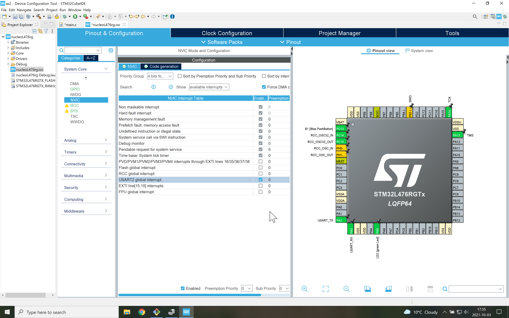

# Non Blocking USART Rx
This branch uses an **interrupt** each time a character (byte) is received (which is a variable) and retransmits it back to the laptop.
To illustrate that "Blinky" toggles the green LED every quarter of a second.

Note again that the callback function is NOT part of the main() function.
It is called by the interrupt service routine.

