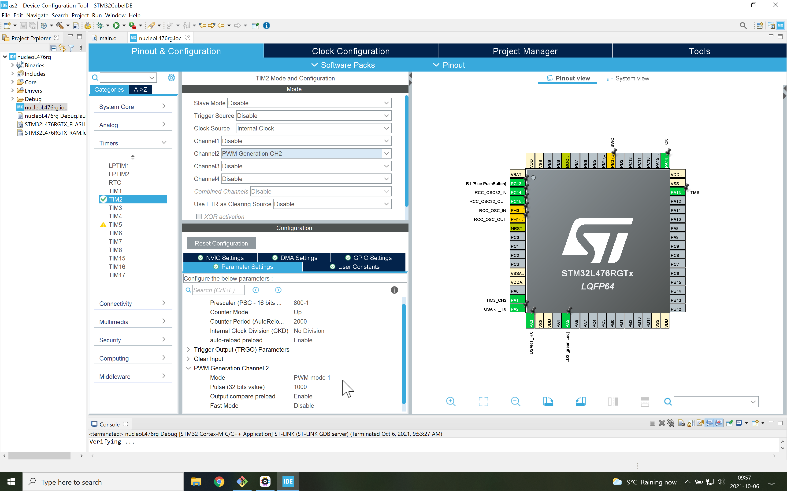

# Prallax servo motor control
In this branch, we generate a PWM (pulse width modulation) signal to control the position of a servo motor.
The period is 20 ms and when the pulse width is 1.5 ms, the servo is centered.

The servo rotates slowly counter-clockwise until it reaches it limit and then jump back to its clockwise limit before repeating the cycle.

