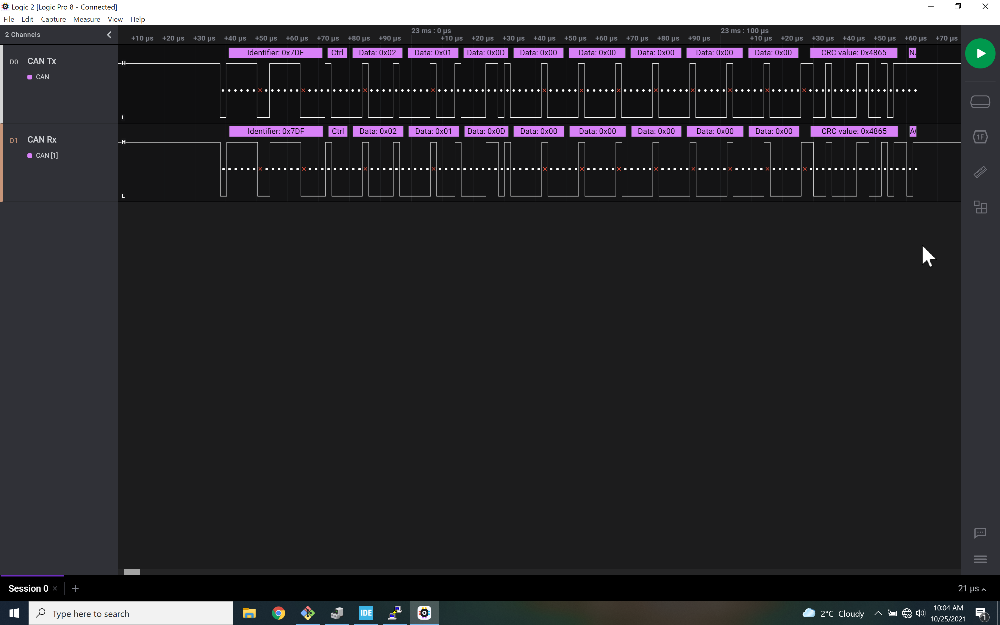
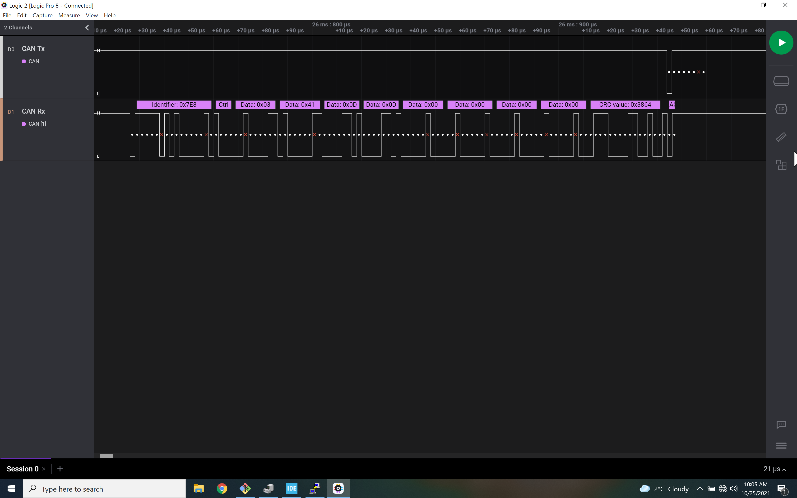
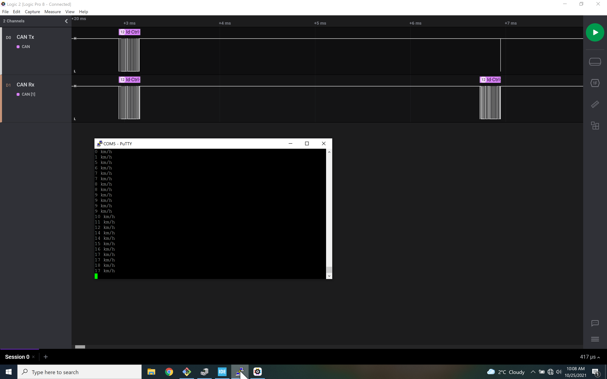
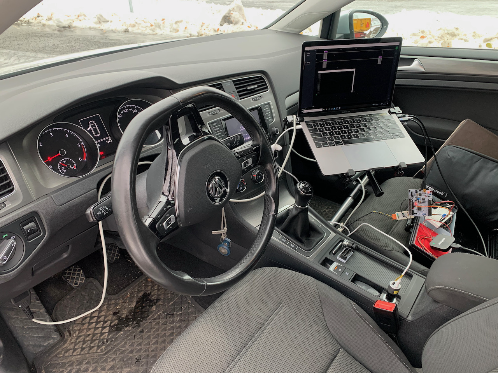
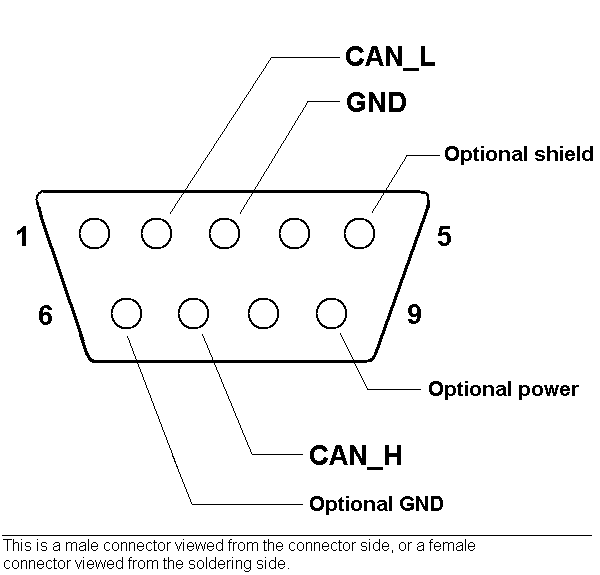

# Vehicle speed from CAN bus over the diagnostic port
This implementation of the code requests the speed of the car from the engine controller every half second and displays the velocity over UART on a connected laptop.

A CAN transceiver is required and it is not on the Nucleo board.

A good explanation can be found on CSS Electronics's [web page](https://www.csselectronics.com/pages/obd2-explained-simple-intro) where they explain each of the bytes sent and received (see § Raw OBD2 frame details).

The setup of the chip are similar to that of the CANloopback branch, except that it is in **Normal** mode rather than Loopback

The Nucleo board makes a request for information (CAN frame with message id 0x07DF), with a payload for the *two bytes* of interest *current* *velocity* (0x02, 0x01, 0x0D).

And it gets back the message with id [0x7E8](https://en.wikipedia.org/wiki/OBD-II_PIDs).
The payload is showing the number of bytes of interest, the current data, velocity and its value (0x03, 0x41, 0x0D, 0x00 (the car is not moving)).
.
The UART messages are

The vehicle setup connects to the diagnostic port of the vehicle.

The cable then uses a serial 9 pin connector, which is commonly used in with CAN tools.
The wiring is as follow:
