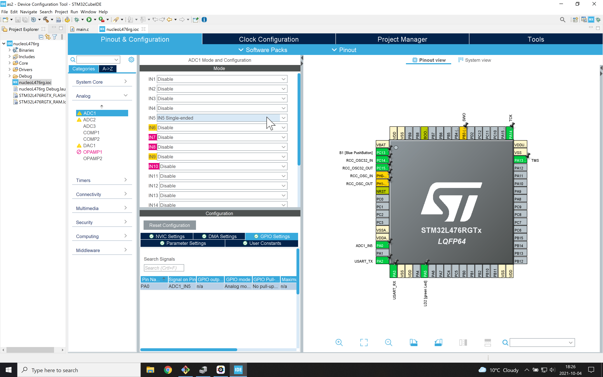

# Analog to Digital Conversion
The analog signal (0-3.3 V) connected to the Arduino style input A0 is converted  in the while loop into a number and reported to the laptop using UART.

This code is based on Digikey [tutorial](https://www.digikey.se/sv/maker/projects/getting-started-with-stm32-working-with-adc-and-dma/f5009db3a3ed4370acaf545a3370c30c) with Shawn Hymel.

