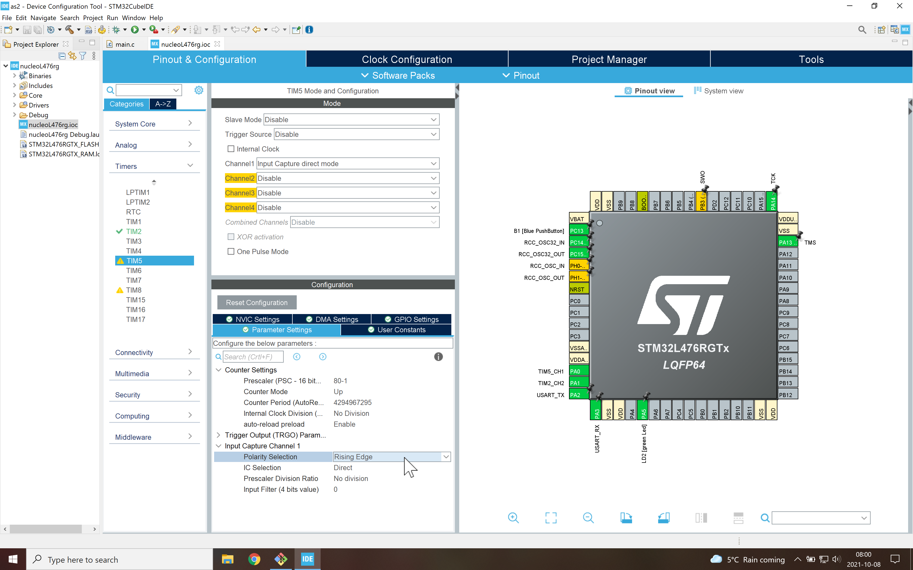
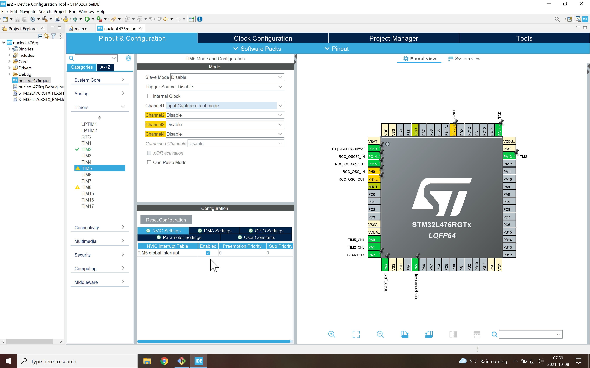

# Input Capture
The idea here is to measure the time between state changes at a pin (low to high, or high to low, rising edges or falling edges).
This is useful when measuring [RPM](https://en.wikipedia.org/wiki/Tachometer) or [wheel speeds](https://en.wikipedia.org/wiki/Wheel_speed_sensor).

In this example, we use Timer 5's channel 1 to capture rising edges with each count being 1 microsecond long (80 MHz down to 1 MHz).
An interrupt is generated at each event.

