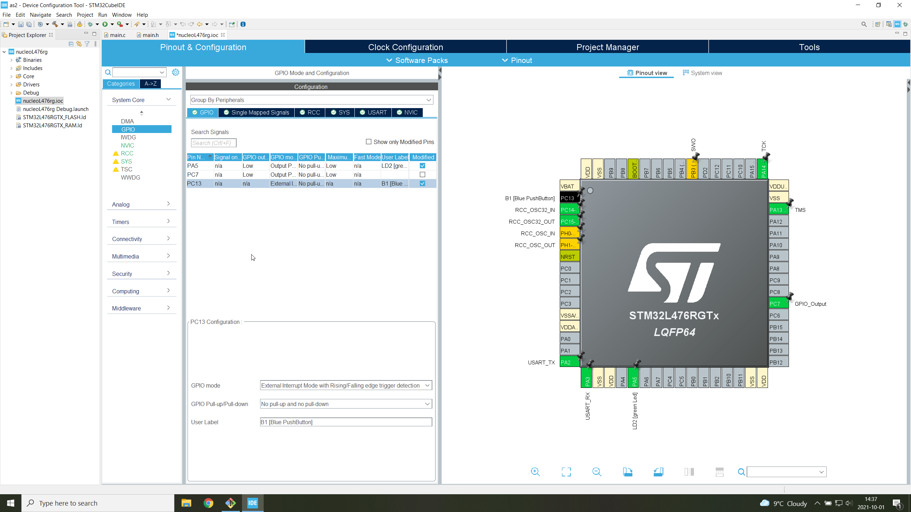

# External Interrupts
The title non-blocking LED is a bit misleading since nothing is done to the flashing (external LED) as seen in the booking LED branch. 
We here use external interrupts to deal with the logic that delayed the reaction to an external state change. 
(If we wanted to make the flashing LED non-blocking, we might choose to use pulse width modulation (PWM), which is covered later on.)
Comparing the signals form the two implementations (BlockingLED and nonBlockingLED) should make the concept clear.

The idea here is that when a state change occurs on the blue button input pin, a call back function is executed.
ST Microelectronics has a good [video](https://youtu.be/w_81fHydEoE) about it.

To set the blue button to cause interrupts, one must choose which mode and then turn on the external interrupts.

