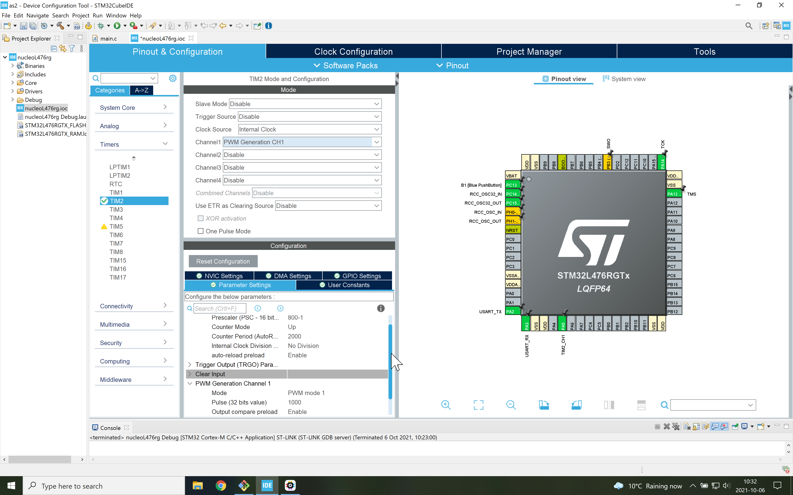

# Breathing LED
The point of this branch is to start playing with timers and counters to form pulse trains of varying width (or, pulse width modulation PWM).

We use the on-board green LED to brighten it and then dim it, before repeating the process again.
That is the on-pulse gets wider and wider before shrinking it again.

The green LED is associated with Timer 2. The clock frequency is 80 MHz, which we reduce down to 100 kHz. With a saw tooth pattern of 2000 counts, we toggle the LED when [CCR1](Capture/Compare register 1) is reached.

For more information on general-purpose timers for STM32 microcontrollers on can look at the ST [cookbook](https://www.st.com/resource/en/application_note/dm00236305-generalpurpose-timer-cookbook-for-stm32-microcontrollers-stmicroelectronics.pdf) (AN4776)

Note that updating the pulse width in the main() function might not be wise if  there happen to be a blocking function.

