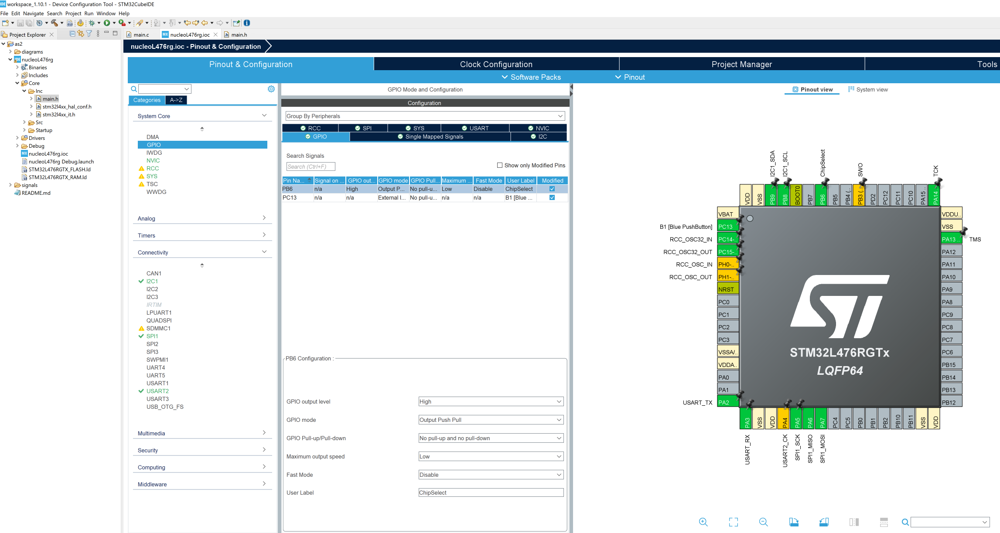
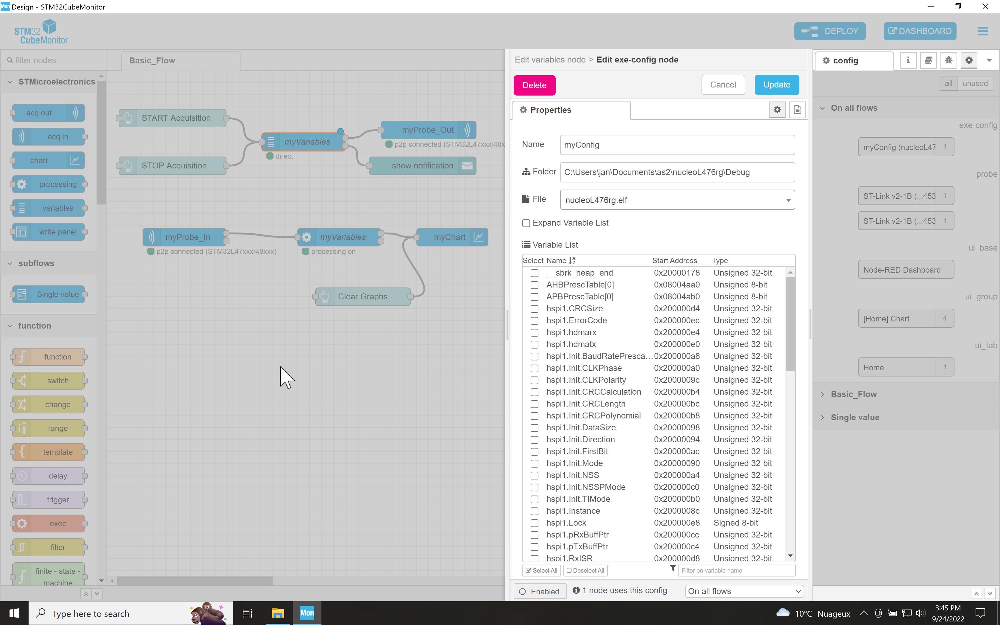

# IMU over SPI
Here, we make use of the Sparkfun 9DOF [IMU](https://www.sparkfun.com/products/15335) over SPI.
It is an ICM-20948 sensor chip, which is low power and measures acceleration, rotation rates (gyro), magnetometer [all in 3 dimensions] as well as temperature.
It is quite an advanced little chip.

On power up, its sensors are off and need to be turned on. (See datasheet, which is in Canvas)
But before that we ask the chip's identity (which is stored it its register 00) and the answer is 0xEA.
If something is wrong, e.g., the wiring or the baud rate, the code is locked in the loop making this request.
Do note that the Chip Select line is on PB6.

The code is also setup to use the [STM32CubeMonitor](https://www.st.com/en/development-tools/stm32cubemonitor.html) to plot in realtime the X acceleration signal versus time (probeX). 
Look at the Signals directory to see setup screenshots of the chip and the CubeMonitor.

The SPI setup is as

The chip select setup is

The ProbeX in CubeMonitor looks like

The list of variables is found in

where you can find ProbeX
