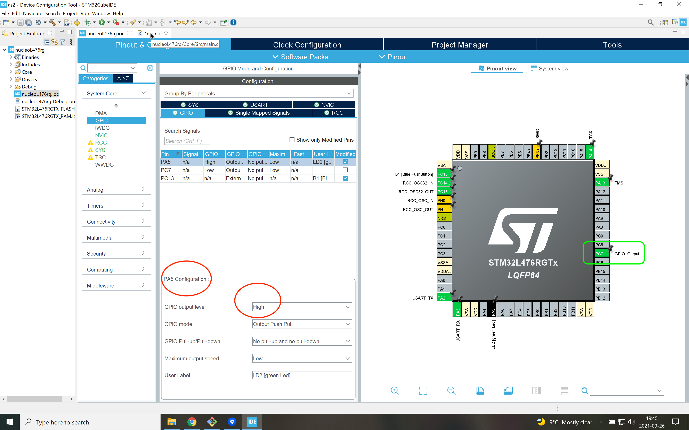

# Dual Blinky
The point of this branch is to start to add your own components.
In this case, this is an external LED.
Do not forget to add a resistor in series with the LED (e.g., follow this [tutorial](https://www.evilmadscientist.com/2012/resistors-for-leds/)).

The two LEDs are out of phase, that is, when one is on, the other is off.
This is set in the beginning when you select the configuration of the chip (see figure below).

