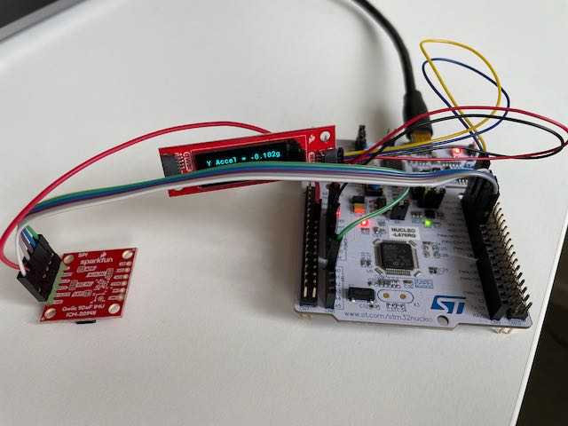
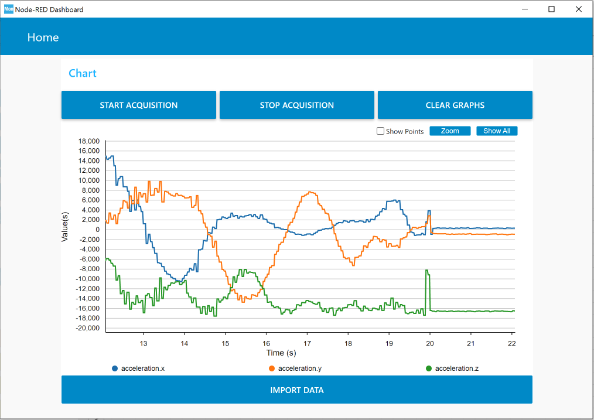
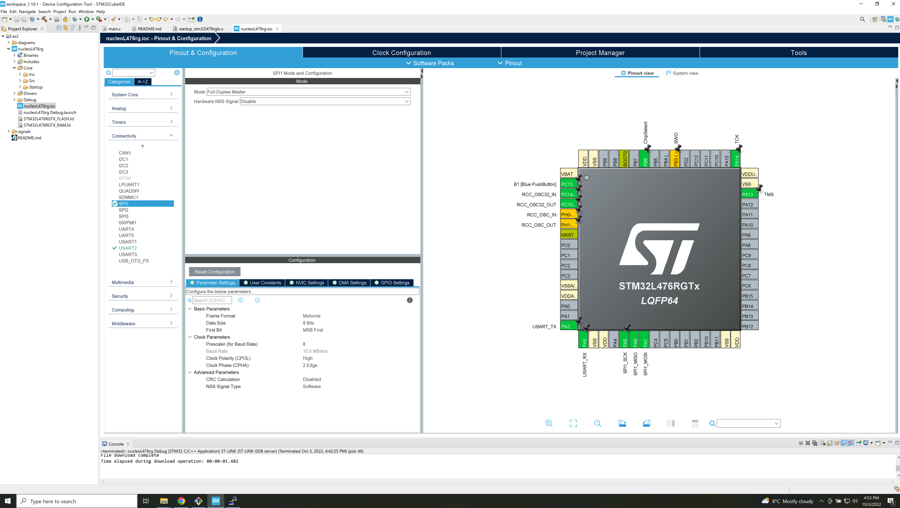
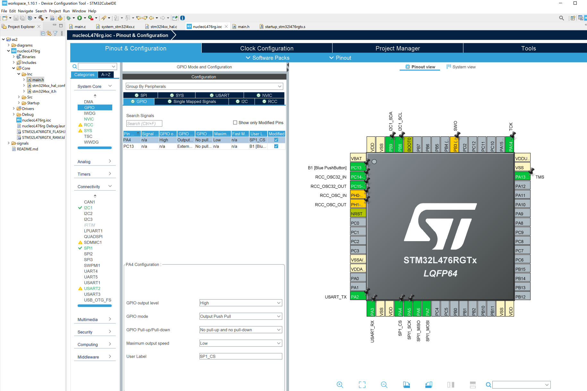

# IMU over SPI with LCD on I2C

Here, we make use of the Sparkfun 9DOF [IMU](https://www.sparkfun.com/products/15335) over SPI.
It is an ICM-20948 sensor chip, which is low power and measures acceleration, rotation rates (gyro), magnetometer [all in 3 dimensions] as well as temperature.

At start up, the microcontroller asks the slave device its identity, if everything is wired correctly, the answer is 0xEA over UART.  (if not, it will the code will be stuck in a loop trying to get the correct answer.)
In this branch, we use *struct*s to combine the three accelerations and we also read all six bytes in one SPI request.

We use the LCD to display the Y acceleration

The code is also setup to use the [STM32CubeMonitor](https://www.st.com/en/development-tools/stm32cubemonitor.html) to plot in realtime the three acceleration signals versus time . Look at the Signals directory to see setup screenshots of the chip and the CubeMonitor.

The setup looks like

The CubeMonitor shows 

SPI setup

Chip select setup
