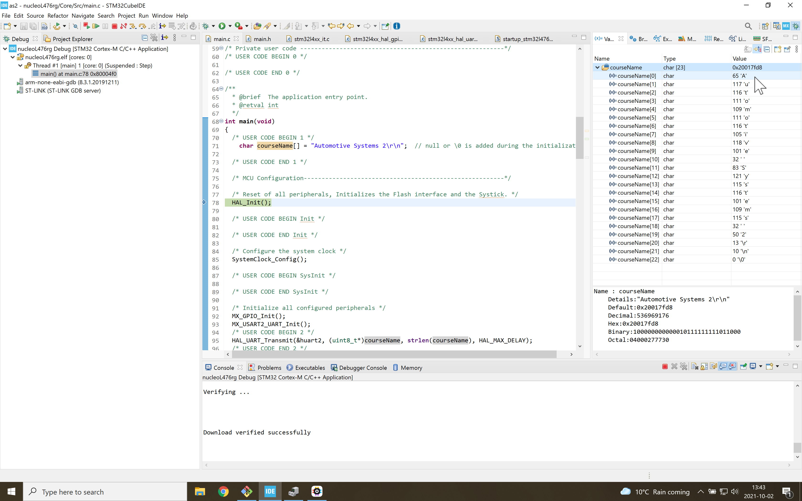

# Hello World

Hello World is usually the first program one writes when evaluating a new computer language.
With a microcontroller, a first program tends to be "Blinky".
In this branch we display a text string on the connected laptop using a terminal emulator like Putty.

In the code we allocate memory for an array of characters.
In the debug mode, one can step through the code and see what is in the chip's memory (right side of the figure below).

We then use the UART peripheral to transmit the text string to the laptop.

