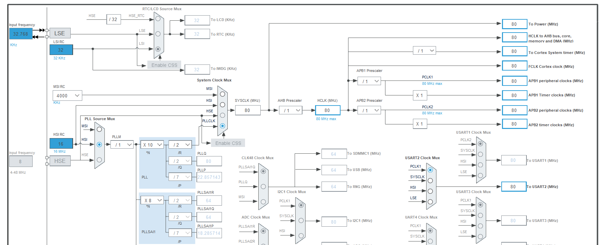
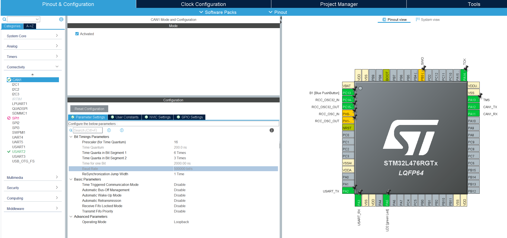
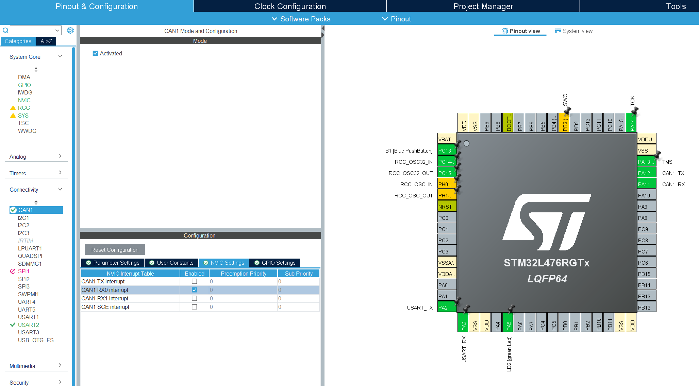

# CAN Loopback
This is a good introduction to CAN.
The code here is based on the [YouTube tutorial](https://youtu.be/JfWlIY0zAIc) by Controllers Tech (part 1 of 2). 
It is a good introduction to CAN frames and CAN filters.

In this implementation, a baud rate of 500 000 bits/second is selected to be able to use it with a car diagnostic port later on.
There is a prescaler for time quantum of 16 (200 ns per time quanta) with 6 time quanta in bit segment 1 and 3 time quantas in bit segment 2.
This implementation is in loopback mode as is in the video and using FIFO 0.

