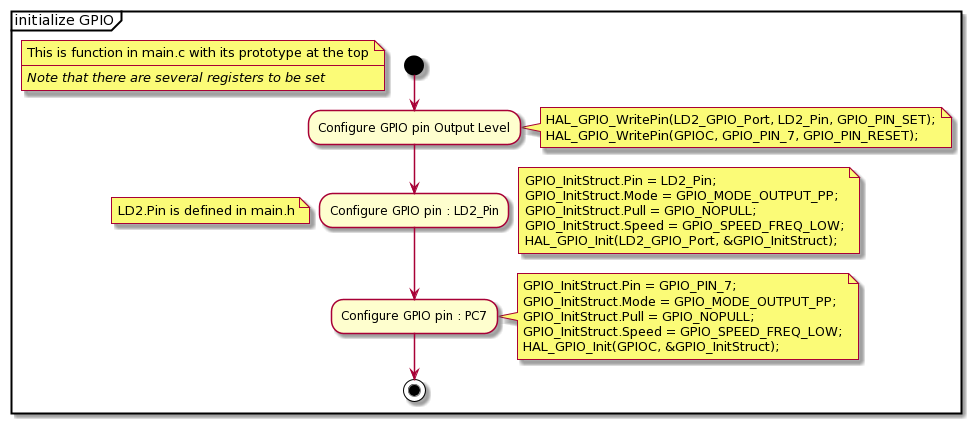
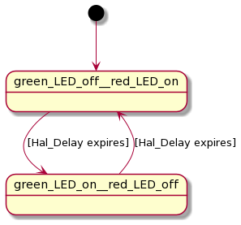

# UML Diagrams

The use case diagram for the dual blinky program is

The activity diagrams for the Blinky program are

The state diagram for the Blinky program is

######Description

The diagrams explain a the function of a program toggling multiple lights. One of the lights being an internal LED and the other is an external LED light.
A use for these kinds of blinking lights could be used on a larger scale at a 70's disco for example. The states of the program are almost identical with the states described in "blinky".
The activities can also be seen as almost identical but with one extra pin to toggle.

