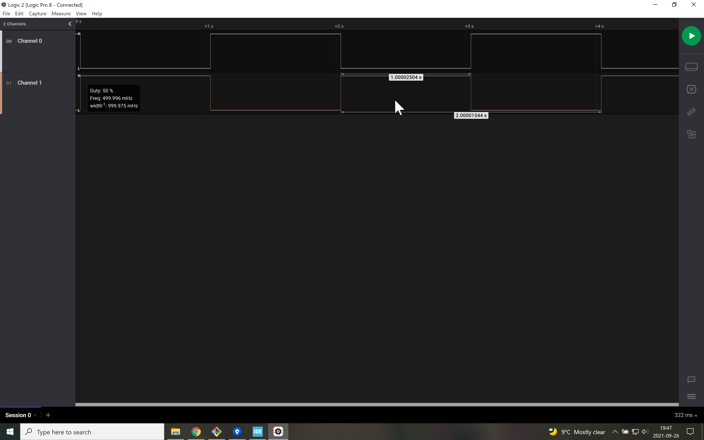

# Dual Blinky
There are two signals of interest here:
- the green LED (on D13)
- the external LED (on D9)

They are out of phase (i.e., when one is on, the other is off). Their period is 2 seconds with 50% duty cycle.

