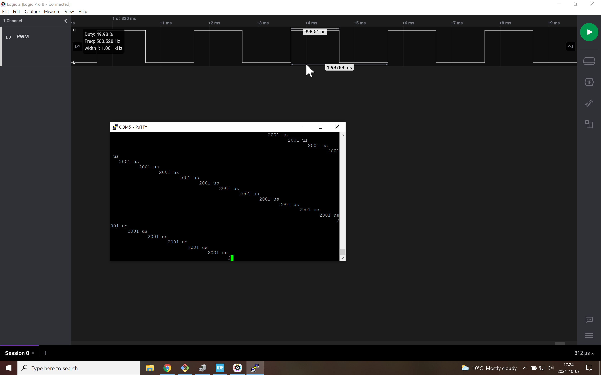

# Signals
To demonstrate input capture, we generate a 50% PWM from Timer 2 (PA1, refer to pwmServo branch) and measure the time between rising edges using input capture from timer 5 (PA0). With the pre-scaler of 80 (80-1, counting the 0), the counter is at 1 microsecond interval (or 1MHz frequency).

