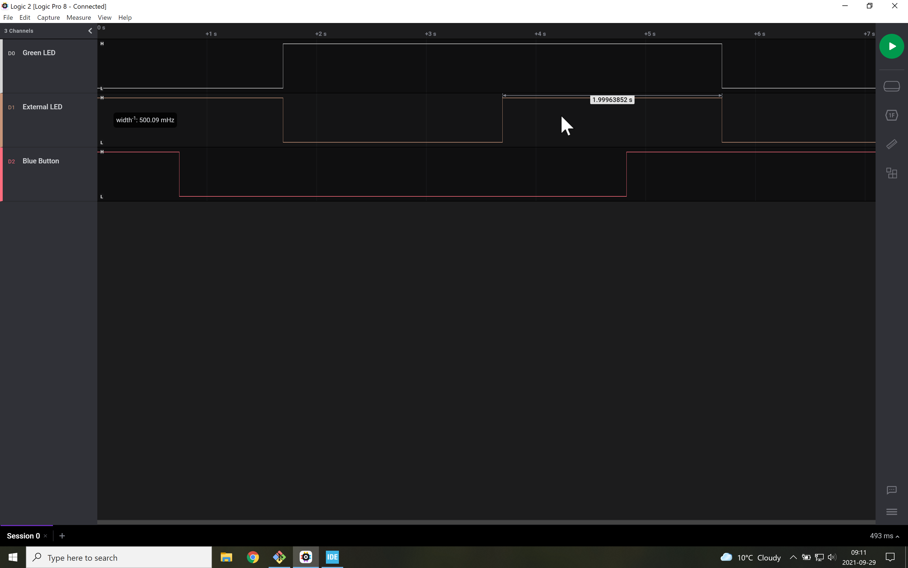

# Signals
The external LED toggles every two-seconds (middle signal shown below).
When the blue button is pressed (bottom signal), it is not until the external LED changes state that the green LED (top signal) changes state.

