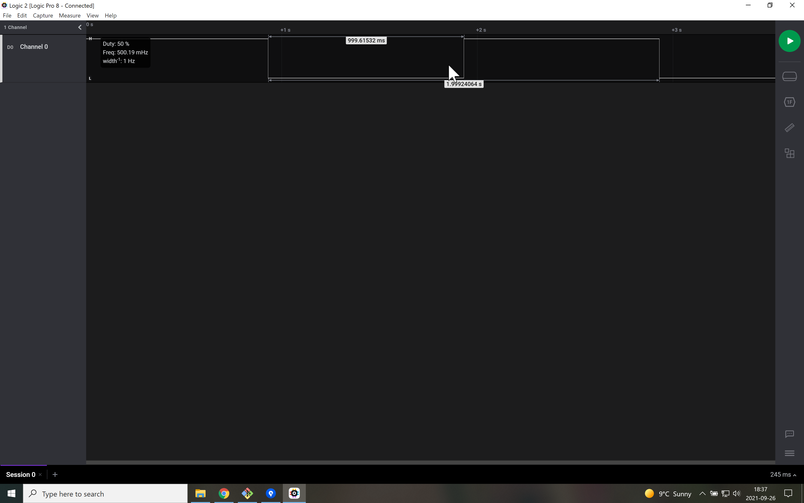

# Signals
When the program runs on the microcontroller, the green LED should flash with a period of 2 second and 50% duty cycle.
Using the Saleae Logic Analyzer, it looks like the figure below when sampling on D13.

