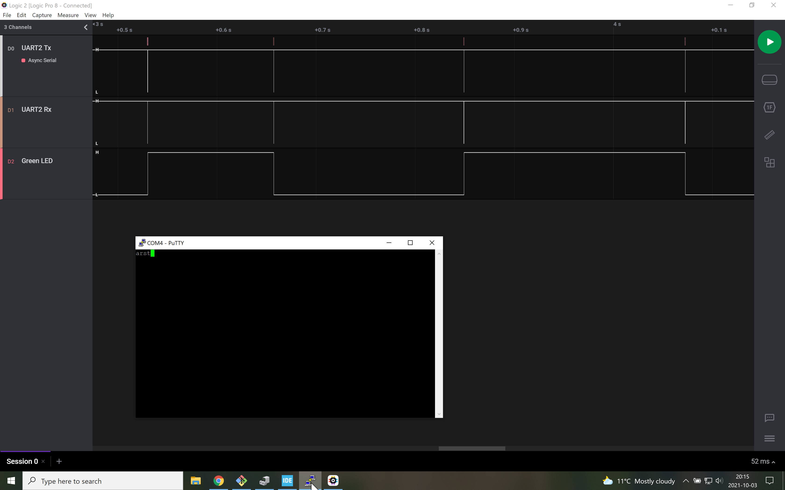
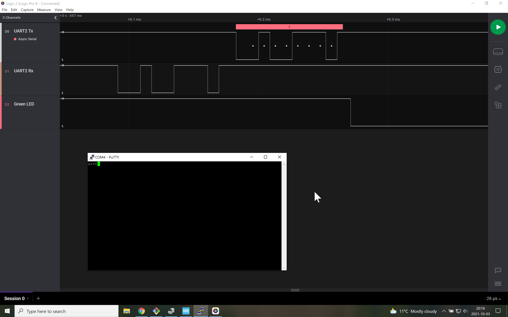

# Signals
Here, we see that the green LED (third signal) toggles only when a new character is received.
Waiting for a new character blocks other activity in the main() function.
There is an immediate reaction of the microcontroller when a key is pressed (returned the received letter).

