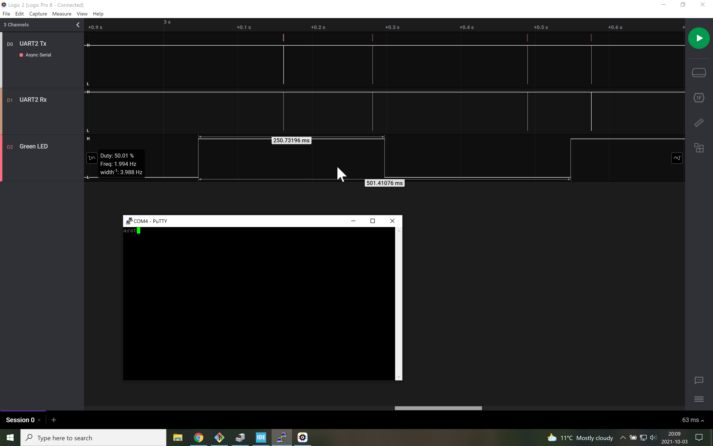
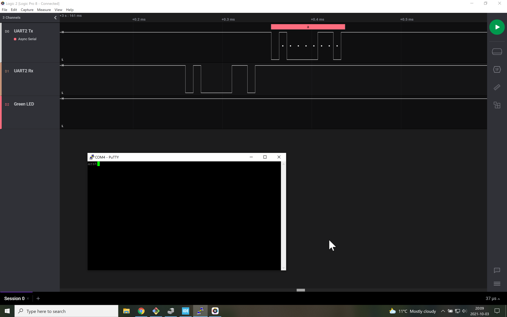

# Signals
Here, we see that the green LED (third signal) keeps blinking every quarter of a second, regardless of when the keys on the laptop are pressed.
There is an immediate reaction of the microcontroller when a key is pressed (returned the received letter).

