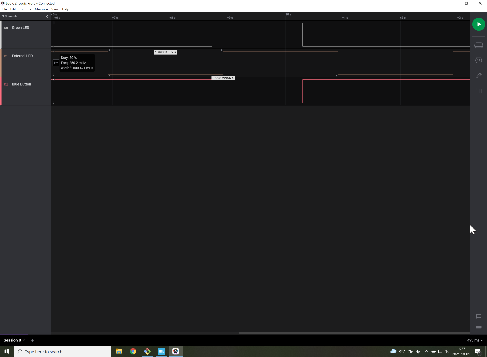

# Signals
The external LED toggles every two-seconds (middle signal shown below).
When the blue button is pressed or released (bottom signal), it interrupts the normal execution of the main loop to change immediately the state of the green LED (top signal) .

