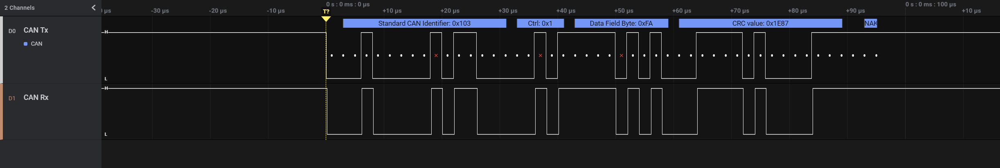

# CAN signals
One can clearly see the frame being sent out with the message identifier 0x103 and the data field 0xFA.
The red X marks indicate stuffed bits. 
They are supposed to be there. 
The X simply lets you know that the bit is not included in the data and is only added for [bit stuffing](https://en.wikipedia.org/wiki/CAN_bus) §Bit stuffing.

